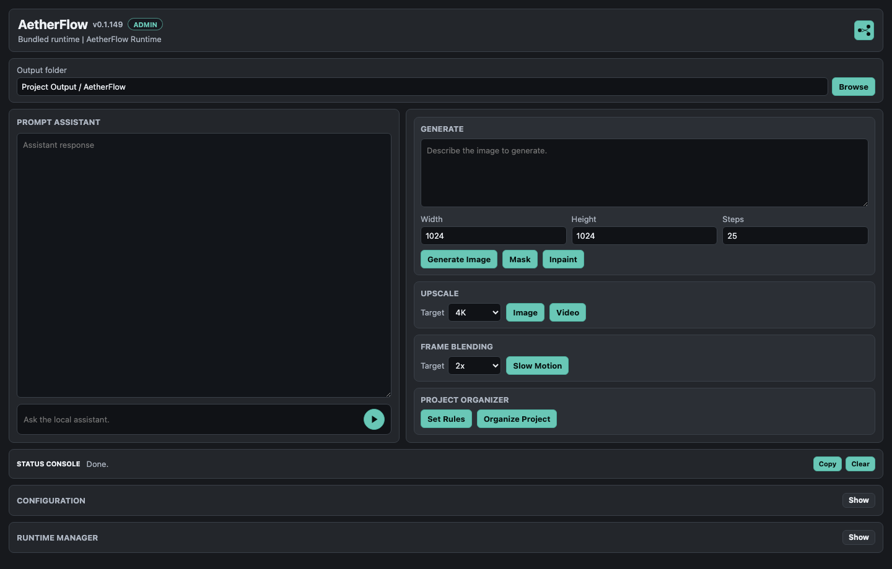
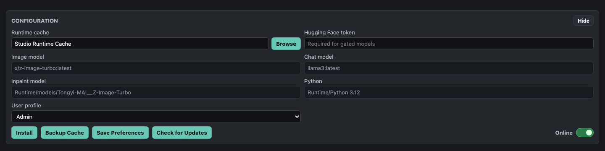
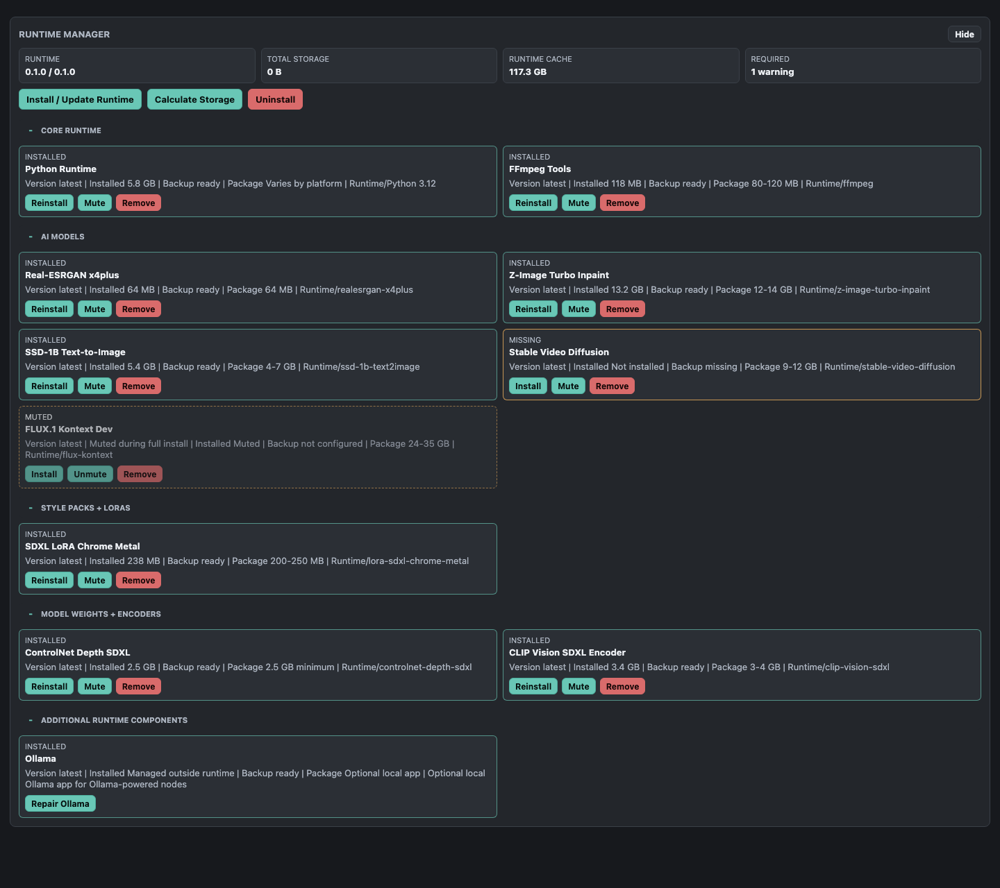
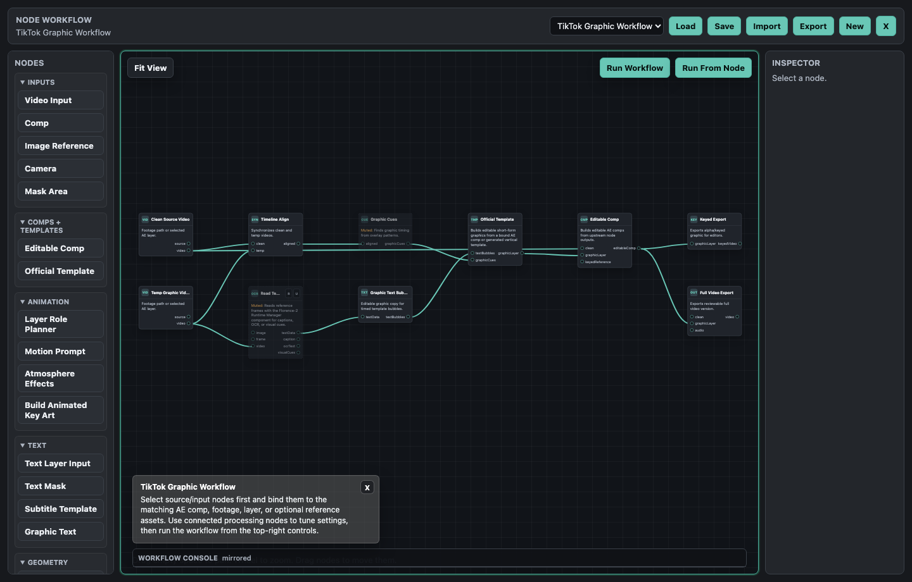

# AetherFlow


AetherFlow is an Adobe After Effects extension for local AI-assisted image, video, text, and workflow automation. It runs as a CEP/ZXP panel and keeps large runtime components, model weights, and optional native plugin packages outside the ZXP so artists can install only what they need.

Source code and internal development materials are private. This repository contains public documentation, install notes, screenshots, and download links only.

## Download

- [Latest AetherFlow release](https://github.com/danrac/AetherFlow_Releases/releases/latest)
- [Public release repository](https://github.com/danrac/AetherFlow_Releases)
- [Optional GitHub Sponsors support](https://github.com/sponsors/danrac)

## Screenshots

### Main CEP Panel



The main panel is the artist-facing workspace for prompt assistance, image generation, upscaling, frame blending, Project Organizer actions, status output, Configuration, Runtime Manager, and the node workflow workspace.

### Configuration



Configuration manages install preferences, runtime cache location, update checks, user profile fields, and Online/Offline install mode.

### Runtime Manager



Runtime Manager shows installed, missing, and muted components grouped by core tools, AI models, style packs, encoders, optional services, and native AE plugins.

### Node Workflow Workspace



The node workflow workspace is the visual editor for multi-step After Effects automation. Users bind comp or layer sources, inspect node settings, run full workflows or branches, and use workflow presets.

## What AetherFlow Does

AetherFlow is designed for production-minded artists working inside After Effects. Workflows start from familiar AE assets: selected layers, comps, footage, stills, text layers, masks, and cameras.

- Generate still images from prompts and bring them into AE comps.
- Edit images with masks or object-aware regions.
- Upscale images and videos with supported local enhancement tools.
- Create slow-motion video with frame interpolation workflows.
- Clean up dark, grainy, or offline footage for review.
- Detect temporary graphics in reference footage and rebuild editable AE precomps.
- Rebuild social-style graphics with OCR, template comps, safe guides, and post-process naming tools.
- Generate editable subtitles from speech.
- Build node-based processing graphs using source, color, cache, viewer, composite, runtime model, and export nodes.
- Manage local runtime components, models, style packs, and optional native AE plugins.
- Use native plugin add-ons for Depth V2, Enhance, Normal Maps, and related plugin-owned workflows when installed.

## First-Time Setup

1. Download `AetherFlow_CEP.zxp` from the latest public release.
2. Install the ZXP with your preferred ZXP installer.
3. Restart After Effects.
4. Open `Window > Extensions > AetherFlow`.
5. Open Configuration.
6. Run `Install / Repair Runtime`.
7. In Runtime Manager, install the components needed for the workflows you plan to use.

Large model files are not bundled inside the ZXP. If a workflow needs a missing component, AetherFlow should show that component as missing or muted so it can be installed from Runtime Manager.

## Online And Offline Runtime Mode

AetherFlow supports both connected and offline/studio-cache installs.

| Mode | Behavior | Use Case |
| --- | --- | --- |
| Online | Uses the configured runtime cache first, then downloads missing approved components when needed. | Connected setup machines and development workstations. |
| Offline | Installs only from the configured runtime cache and does not fall back to public downloads. | Air-gapped or restricted production workstations. |

For a studio setup, install components on one connected machine, sync the runtime cache to a shared server or approved storage location, then point offline workstations to that cache.

## Native AE Plugin Add-Ons

AetherFlow can install native After Effects plugins separately from the main ZXP. These plugin packages are distributed through the public release repository and managed from Runtime Manager.

Current plugin package areas:

- AetherFlow Depth V2
- AetherFlow Enhance
- AetherFlow Normal Maps

Plugin add-ons are platform-specific. Runtime Manager should download the correct package for macOS or Windows when those packages are available.

## Built-In Workflow Areas

Common workflow areas include:

- TikTok Graphic Workflow
- Template Text Graphics Workflow
- Basic Subtitle Workflow
- Offline Enhancement Workflow
- ESRGAN Image/Video Upscale workflows
- RIFE Slow Motion Workflow
- Text Designer Workflow
- Graphic Removal Edit Workflow
- Layered Key Art Animation Workflow
- Custom Model / Runtime Model experiments
- Camera solve and media routing experiments where enabled

Some advanced workflows are still evolving. Treat generated outputs as editable AE starting points, not guaranteed final renders.

## Firewall Allowlist

For public documentation and release downloads, allow:

```text
https://danrac.github.io/AetherFlow_Docs/
https://github.com/danrac/AetherFlow_Releases/releases/
https://github.com/danrac/AetherFlow_Releases/releases/download/
https://objects.githubusercontent.com/
```

Optional support link:

```text
https://github.com/sponsors/danrac
```

## Troubleshooting

If updates or downloads fail:

- Confirm the latest release page opens in a browser.
- Confirm the ZXP asset downloads directly from the release page.
- Check firewall rules for GitHub release asset downloads.
- Restart After Effects after installing a new ZXP or plugin package.
- Open Runtime Manager and verify whether required components are installed, missing, muted, or need repair.

## Public Distribution Model

- `danrac/AetherFlow_CEP`: private source and development repository.
- `danrac/AetherFlow_Docs`: public documentation and GitHub Pages.
- `danrac/AetherFlow_Releases`: public downloads, release notes, checksums, and plugin packages.
