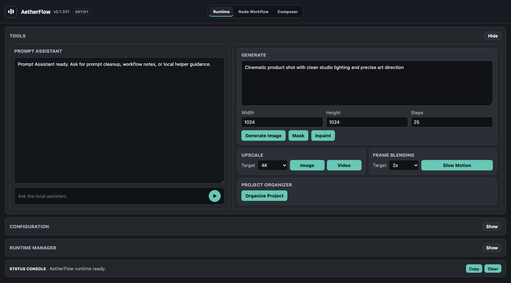
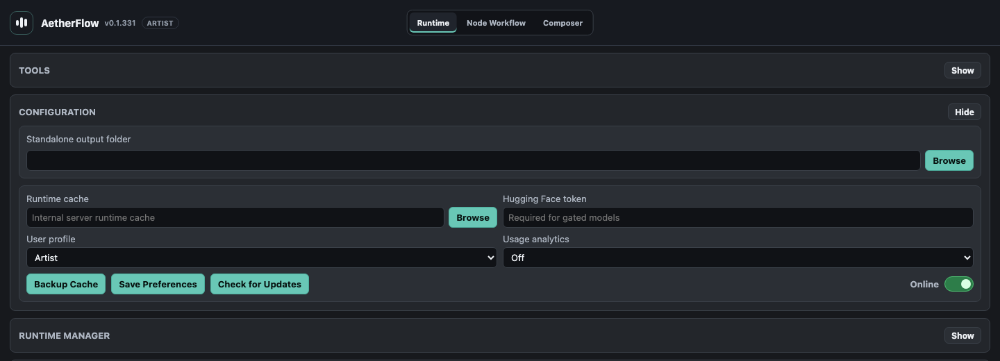
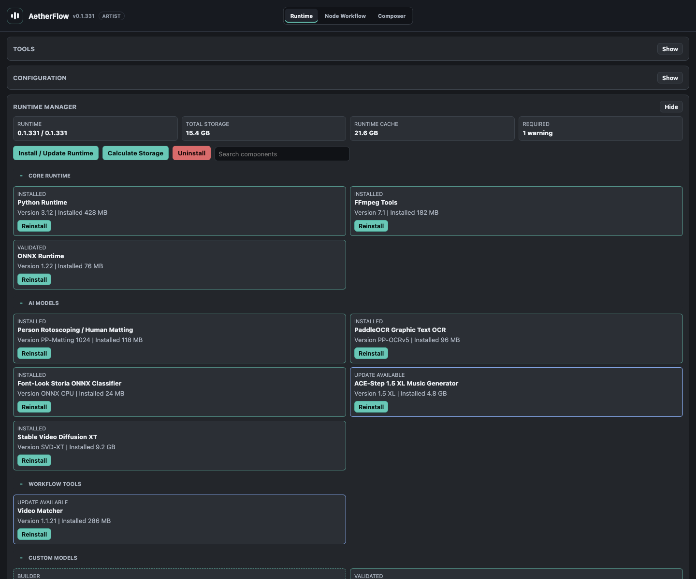
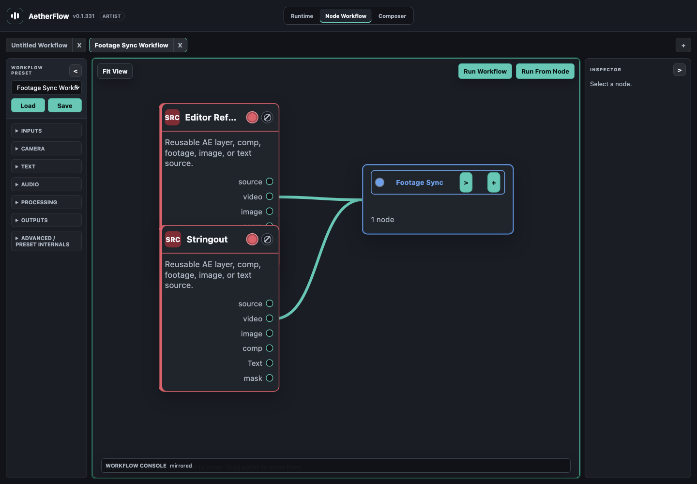
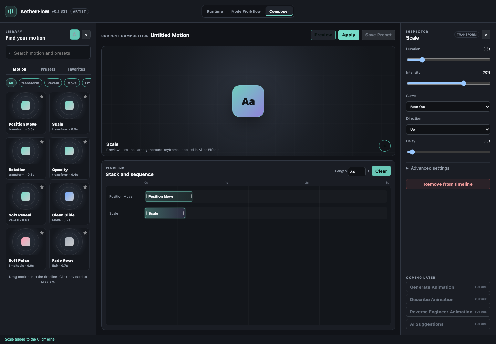

# AetherFlow

Adobe After Effects extension for local AI-assisted creative workflows.

[Download Latest Release](https://github.com/danrac/AetherFlow_Releases/releases/latest)
[View Release Repository](https://github.com/danrac/AetherFlow_Releases)
[Sponsor Development](https://github.com/sponsors/danrac)



The Runtime workspace provides quick access to Prompt Assistant, image generation, mask/inpaint, upscaling, slow motion, Project Organizer, Configuration, and Runtime Manager. The shared header switches directly between Runtime, Node Workflow, and Composer.

## Overview

AetherFlow runs inside After Effects as a CEP/ZXP panel. It provides artist-facing tools for prompt-assisted image work, footage enhancement, OCR/template graphics, node-based workflow building, runtime management, and optional native AE plugin add-ons.

Large runtime dependencies and model weights are installed after the ZXP through Runtime Manager instead of being bundled into the extension installer.

## Screenshots

### Configuration



Configuration stores output/cache preferences, user profile, usage analytics preference, update checks, Hugging Face token input, Online/Offline mode, and Runtime cache settings for studio or offline deployment.

### Runtime Manager



Runtime Manager installs and reports status for local models, native plugin packages, Python helpers, source-cache restores, offline cache behavior, and storage audits. Components are grouped so artists can identify missing, muted, installed, or repairable workflow dependencies.

### Node Workflow Workspace



The node workspace is the project-bound visual editor for workflow graphs. It supports project tabs, source binding, reusable nodes, grouped workflow modules, inspector settings, workflow console output, and saved or imported presets.

### Animation Composer



Composer provides a motion library, shared keyframe-plan preview, stackable and trimmable timeline blocks, and controls for timing, intensity, curves, direction, delay, and advanced motion settings. Apply writes the generated plan to selected AE layers; Composer preset persistence and its disabled AI tools remain in development.

## Workflow Areas

- Prompt-assisted still image generation and image editing.
- Local enhancement, upscaling, cleanup, and slow-motion workflows.
- TikTok Graphic and Template Text Graphics workflows for rebuilding editable AE precomps from reference graphics.
- Subtitle generation and editable text workflows.
- Node-based source, color, cache, viewer, composite, runtime model, and export routing.
- Native AE plugin add-ons for Depth V2, Enhance, Normal Maps, and related plugin-owned functionality.
- Runtime Manager installs, repairs, mutes, and verifies local components.

## Install

1. Download `AetherFlow_CEP.zxp` from the latest release.
2. Install the ZXP with your preferred ZXP installer.
3. Restart After Effects.
4. Open `Window > Extensions > AetherFlow`.
5. Open Configuration and run `Install / Repair Runtime`.
6. Use Runtime Manager to install the workflows, models, and plugin packages needed on that machine.

## Online And Offline Runtime Mode

| Mode | Behavior |
| --- | --- |
| Online | Uses the configured runtime cache first, then downloads missing approved components when needed. |
| Offline | Installs only from the configured runtime cache and does not use public internet fallback. |

For restricted studio machines, populate a shared runtime cache from a connected machine, then point offline workstations to that cache.

## Firewall Allowlist

```text
https://danrac.github.io/AetherFlow_Docs/
https://github.com/danrac/AetherFlow_Releases/releases/
https://github.com/danrac/AetherFlow_Releases/releases/download/
https://objects.githubusercontent.com/
```

Optional support link:

```text
https://github.com/sponsors/danrac
```

## Distribution

The public distribution model is split into:

- Private source/development: `danrac/AetherFlow_CEP`
- Public docs/site: `danrac/AetherFlow_Docs`
- Public downloads/releases: `danrac/AetherFlow_Releases`

Source code, build internals, and proprietary implementation details are not distributed publicly.
